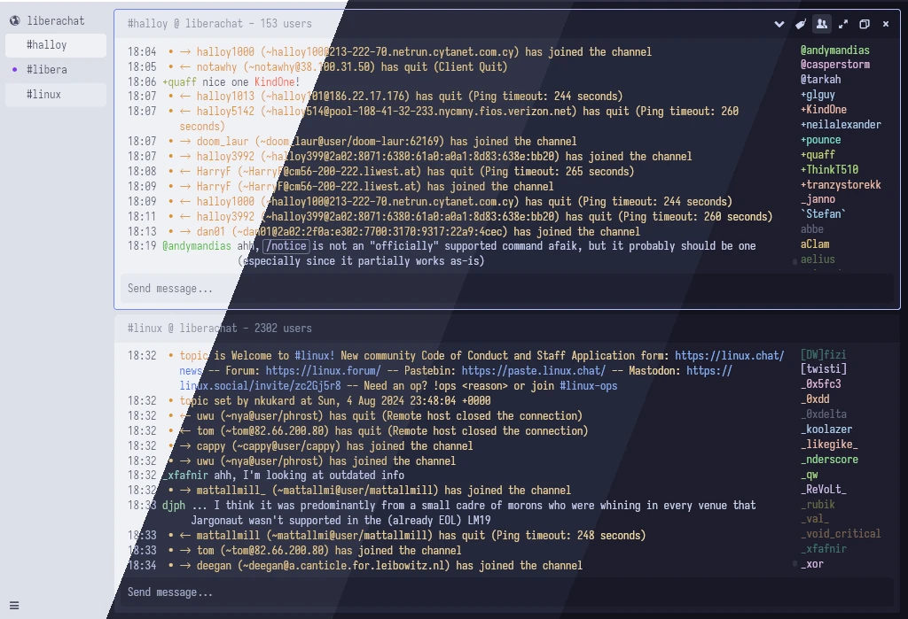

<h3 align="center">
	 
	
	Catppuccin for <a href="https://github.com/catppuccin/template">App</a>
	
</h3>

	
	
	

	

## Previews

🌻 Latte

🪴 Frappé

🌺 Macchiato

🌿 Mocha

## Usage

1. Clone this repository locally
2. Copy the desired `<theme>.yaml` file into your themes directory:  
  - Linux: `$HOME/.config/halloy/themes`
  - macOS: `$HOME/Library/Application Support/halloy/themes`
  - Windows: `{FOLDERID_RoamingAppData}\halloy\themes`
4. Update the `theme:` field of your `config.yaml` to the name of the theme without the `.yaml` file extension:
  - `theme: "catpuccin-frappe"`
5. Restart Halloy

## 💝 Thanks to

- [Daeraxa](https://github.com/Daeraxa)

&nbsp;

	

	Copyright &copy; 2021-present <a href="https://github.com/catppuccin" target="_blank">Catppuccin Org</a>

	

